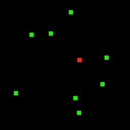

# Police State

> He who is subjected to a field of visibility, and who knows it, assumes responsibility for the constraints of power - Foucault

The Police State is a dystopian set of OpenAI gym environments where the objective, for the agent, is to spot the "criminal" dot in a crowd of eight dots. The agent observes the position of all dots in a grid environment.

```
                    ▒▒▓▓████████▓▓▓▓░░                  
                    ██████████████████                  
                    ██████████████████                  
                    ██████████████████                  
                    ██████████████████                  
            ▓▓██████████████████████████████▓▓          
                    ▒▒░░  ░░        ▒▒                  
                    ██████▓▓▒▒████████                  
                    ██████▒▒  ████████                  
                      ██▓▓    ▓▓▓▓██                    
              ▓▓▒▒                      ▓▓██            
                ██▓▓              ██████████            
                ██████        ██████████████            
                ████████▒▒    ██████████████            
                ██████████▒▒  ██████████████            
              ▓▓██████████▓▓  ██████████████            
          ▓▓████████████████  ████████████████░░        
      ▓▓████████████████████  ████████████████████      
    ████████████████████████▓▓██████████████████████
```

## Getting started

Dependencies:
- Python 3

*Police State* is based on OpenAI Gym. You can install the package as follows, which will automatically install all dependencies:

```
# Warning: not implemented yet!
pip install policestate
```

Minimal example:

```
import gym
import policestate

env = gym.make('Runny-v0')
env.reset()

done = False
while not done:
    action = env.action_space.sample()
    state, reward, done, _ = env.step(action)
    print(state, reward, done)
```

## Environments

An environment is made up by:
- 64 x 64 grid world
- eight dots (numbered 0-7) that move around the grid, seemingly at random
- one dots that is the criminal *c*. Your job is guess who *c* is.

The movement of the dots depends on the environment.



### State

The state of the environment is a list of dot positions in the grid world. For example, the state [0, 0, 0, 0, 0, 0, 0, 0] means that all dots are currently in the upper left corner, while the state [2021, 0, 0, 0, 0, 0, 0, 0] means that the first dot is somewhere around the middle.

### Actions

The agents's objective is to guess who the criminal is and can take two kinds of actions *a*:

|Action|Semantics|
|-|-|
|8|Do nothing|
|0-7|Guess that the *i*'th dot (*i*=action) is the criminal *c*|

The environment runs for at most T=100 rounds, and ends either if you run out of time (i.e. t = T), or the agent correctly guesses the criminal's identity. at each turn the agent must choose an action *a* with a number between 0-8. The enviroment

### Rewards

The reward is computed as follows, for action *a* and time *t*:

|Case|Description|Reward|
|-|-|-|
|t ≥ T|Time ran out|-100|
|a = 0|Agent did nothing|-1|
|a ≠ c|Agent guessed wrong|-50|
|a = c|Agent guessed who the criminal is|100|

### Criminal's behaviour

The criminal's behavour depends on the environment. The different environments are listed below.

|Environment name|Criminal behaviour|Status|
|-|-|-|
|Shaky-v0|The criminal moves more randomly than the others|Coming soon..|
|Runny-v0|The criminal runs a little bit more than the others|Coming soon..|
|Hidey-v0|The criminal hides from the others|Coming soon..|
|Scary-v0|The criminal scares the others away|Coming soon..|
|Snoopy-v0|The criminal stops near the others to eavesdrop|Coming soon..|
|Stalky-v0|The criminal follows the others|Coming soon..|
|Robby-v0|The criminal runs to and away from others|Coming soon..|
|Thiefy-v0|The criminal visits "houses" while others are at "work"|Coming soon..|
|Drunky-v0|The criminal walks in a wavy pattern|Coming soon..|
|Killy-v0|The criminal kills the other dots if close and then stop moving|Coming soon...|
|Seducy-vo|The criminal attracts the other dots|
|Randy-v0|The criminal picks a random behavior|Coming soon..|
|Shifty-v0|The criminal randomly shifts between behaviours|Coming soon..|


## Credits

Ascii art from [textart.sh/topic/spy](https://textart.sh/topic/spy).
